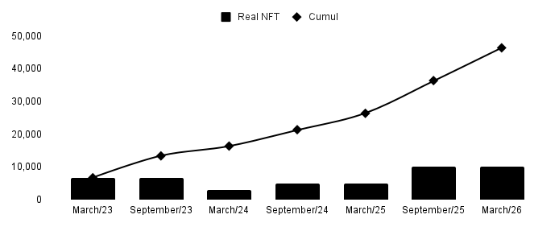

# Supply

## Real Horse NFTs

**Only one NFT is created for each horse selected to join the game.**&#x20;

All horses are licensed under LeTrot and France Galop. We plan to expand to other countries through new licenses and will also release horses from the past.

**Selection Criteria**

Currently, between 30,000 and 40,000 horses participate in PMU races, called Premium races, which are listed on pmu.fr. These horses are at various stages of their careers, and we select them for flat, harness, and obstacle races.

Stables has decided to initially introduce NFTs of horses at the start of their careers, beginning from their first participation in a premium race. This selection will occur every six months and will include approximately 3,000 NFTs each time.

**Drop 1 & 2**

The first drop in March 2023 consisted of 6,666 NFTs. The details for the next drop are still to be defined. To achieve this volume, we introduce horses that began their careers up to three years ago but have raced recently in the last six months (indicating they race regularly). These first two drops are exceptional in composition and price; Stables will price real horse NFTs higher in the future.

**International Expansion**

Once we secure licenses in other countries, we plan to release 5,000 to 10,000 new NFTs every six months.

<figure><figcaption>
Drop schedules for the coming years
</figcaption></figure>

## Virtual NFTs

We expect to reach 100,000 players within 12 to 18 months. With a limited supply of real horses, this means that within a year, we need to find ways for new players to participate. We plan to release new NFTs that are not based on real horses.

We intend to create hybrid NFTs (resulting from "breeding") that will have a moderate or even zero cost. These NFTs won't receive the benefits of real horse NFTs, such as passive S-Points generation or breeding abilities, and they won't be as prominently featured in the game.

Real horse NFTs will become rarer over the coming years and will likely be highly sought after on the secondary market.
