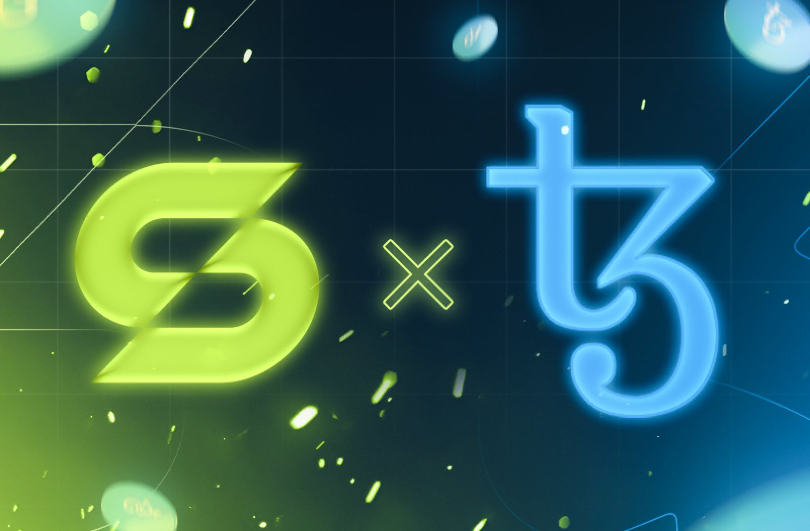

# ⛓️ Blockchain (Tezos)

We chose Tezos after a wise review of many blockchains early 2022, our final choice being an Ethereum Layer 2 or Tezos.&#x20;

We believe Tezos has all we need to develop the game for now, and has strong fundamentals for the future, the principal argument being Tezos onchain governance that allows the protocol to be regularly upgraded (without the need of a fork).&#x20;

This allows Tezos to integrate new features progressively as its users base and transactions volume grow. It also opens the possibility to become Ethereum compatible in the future, which is something that may be unveiled in a close future.

<figure><figcaption></figcaption></figure>

Here's the top 6 of our reasons to use Tezos:

1. A high level of security on the blockchain (LPoS)
2. A low energy cost&#x20;
3. A good currency stability that allows us to stake Tezos without much risks&#x20;
4. A large community of corporate partners such as Ubisoft, Decathlon, EDF or Casino
5. A mid to long-term operating expectancy
6. The native ability to update its software

## Our existence on the chain

We're using nodes provided by Exaion and we plan to maintain our own node, especially because we want to host our own rollup layer 2 node to manage S-Points transactions in the game.

Here's our smart-contact addresses:

* Stables Pass (NT NFT): [`KT1RqXzEKaChWrBpmfWUmUbMJ7zLRCW2F6YL`](https://better-call.dev/mainnet/KT1RqXzEKaChWrBpmfWUmUbMJ7zLRCW2F6YL/operations)
* Stables NFT Collection: [`KT1MQL8VjVQckk5A6uBfN9Qv2YUVJstG1CyH`](https://better-call.dev/mainnet/KT1MQL8VjVQckk5A6uBfN9Qv2YUVJstG1CyH/operations)
* Stables Sale Contract: [`KT1JF9JfwRc9wwoMEQFUZDZBrVDvrazYdEFK`](https://better-call.dev/mainnet/KT1JF9JfwRc9wwoMEQFUZDZBrVDvrazYdEFK/operations)

Here is the list of wallets on which you'll still find Unrevealed NFTs:

* Stables treasury wallet: tz1Maj1mK5MW7DW82qrWt1X4nuaQLmLVkvuT
* Wallet owned by PMU: tz1R3LNcWR1dpEs45Q4zzvzJYZhnYWnjj5jP

## Provenance Hash

Provenance Hash is a way to prove that we did not edit the list of NFTs, since their metadata is not onchain (it is served from our servers).&#x20;

* NFT Provenance Hash: its the token ID of the NFT and is calculated this way:
  * we use the following information: NFT number in the collection, Birth Country Country Code, Birth Year, Full Birth Date, Horse Official Name
  * all concatenated separated by semicolons, it gives something like `1:FR:2023:2023-01-01:NAME`
  * we then apply the following transformation:
    * _bytes_: `31 3a 46 52 3a 32 30 32 33 3a 32 30 32 33 2d 30 31 2d 30 31 3a 44 41 56 49 44`
    * _little_: `109732130401448801075897904080883403357190557740499221633972785`
    * _modulo 10^12_: `221633972785`, which is the token
* NFT List Provenance Hash: it is the hash of the whole list, we will unveil it soon

## What about other chains?

We plan to look into ways to connect with others chains, either to move NFTs between chains, or to accept sign ups from users from other communities.&#x20;

Still, we believe Tezos will stay our main backend for, say, a while.
